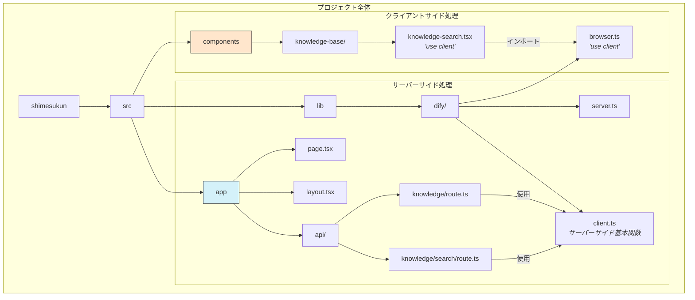

# シメスくん - マンション書類管理システム

マンションの書類をデジタル化し、効率的に管理・検索するための Web アプリケーションです。OCR の活用や横断検索、AI による提案機能を備えています。

## 主な機能

- 📄 **書類アップロード・管理**: PDF・画像ファイルのアップロードと OCR によるテキスト抽出
- 🔍 **高度な検索機能**: キーワード検索とマンション横断検索
- 🤖 **AI 質問応答**: 書類内容に基づく質問応答と関連情報の提案
- 👥 **ユーザー・権限管理**: マンション別のアクセス権限管理

## 技術スタック

- **フロントエンド**: TypeScript, Next.js (App Router), Tailwind CSS
- **バックエンド**: Firebase (Authentication, Firestore, Storage)
- **UI**: Radix UI, shadcn/ui
- **その他**: OCR, Web Speech API（音声認識）

## 開発環境のセットアップ

1. リポジトリのクローン

   ```bash
   git clone https://github.com/yourusername/shimesukun.git
   cd shimesukun
   ```

2. 依存パッケージのインストール

   ```bash
   npm install
   ```

3. 環境変数の設定

   - `.env.local.example` を `.env.local` にコピーし、必要な値を設定

4. 開発サーバーの起動

   ```bash
   npm run dev
   ```

5. ブラウザで [http://localhost:3000](http://localhost:3000) にアクセス

## デプロイ

Vercel を使用したデプロイ方法は [DEPLOYMENT.md](./docs/DEPLOYMENT.md) を参照してください。

## 注意事項

- Firebase 認証を使用しているため、初回起動時に適切な環境変数の設定が必要です
- クライアントコンポーネントとサーバーコンポーネントの区別に注意してください（詳細は [ARCHITECTURE.md](./docs/ARCHITECTURE.md) を参照）

## プロジェクト構成


