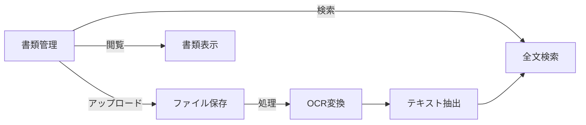
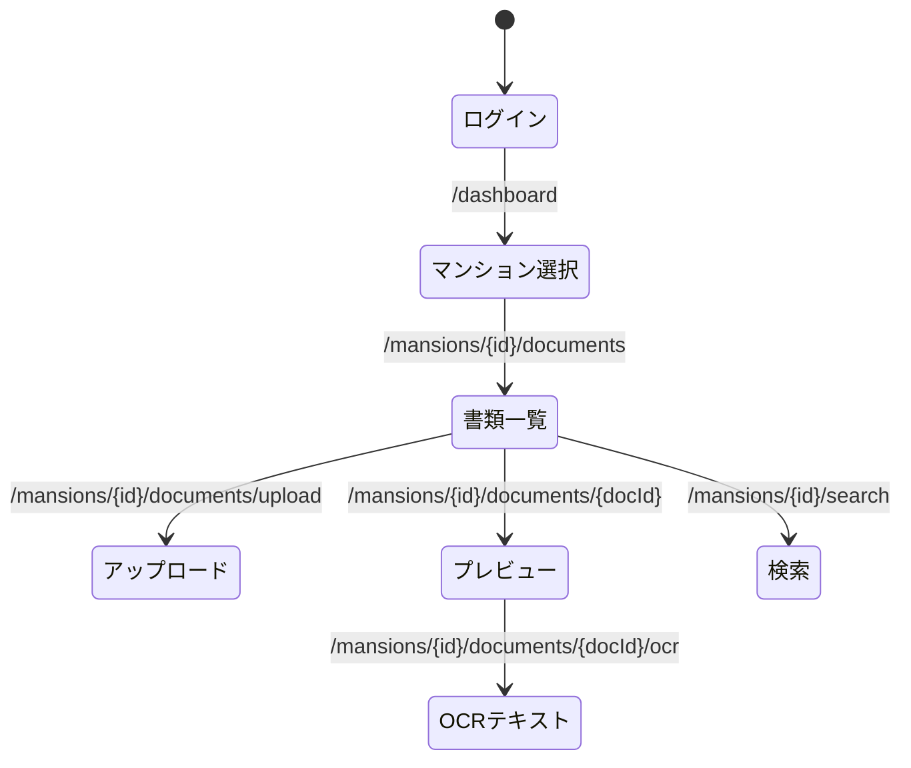

# マンション書類管理システム 開発仕様書

## 1. システム概要

### 1.1 目的

マンションの書類をデジタル化し、効率的に管理・検索するための Web アプリケーション。
既存のものと比べると、OCR の活用、横断検索、質問に対する AI による提案が特徴。

### 1.2 対象ユーザー

- マンション管理会社(MVP 段階での想定ユーザー)
- 管理組合役員
- 一般居住者

## 2. 機能要件

### 2.1 必須機能

#### 2.1.1 書類アップロード機能

- PDF・画像ファイルのアップロード
- OCR によるテキスト抽出（日本語対応）
- アップロード時に AI によってカテゴリーやネーミングを提案
- マンションごとの分類
- メタデータ登録

#### 2.1.2 書類表示機能

- PDF プレビュー
- 画像プレビュー
- OCR テキスト表示
- マンション別一覧表示

#### 2.1.3 検索機能

- キーワード検索（タイトル・OCR テキスト）
- マンション別フィルタリング
- 日付範囲による絞り込み

#### 2.1.4 ユーザー管理機能

- ログイン・ログアウト
- アクセス権限管理
- マンション別権限設定

### 2.2 画面遷移

## 3. 非機能要件

### 3.1 パフォーマンス要件

- ページロード時間: 1 秒以内
- 同時接続数: 10 ユーザー程度

### 3.2 セキュリティ要件

- 入力値のサニタイズ
- SQL インジェクション対策
- XSS 対策

### 3.3 品質要件

- ブラウザ互換性: 最新の Chrome, Firefox, Safari, Edge
- レスポンシブデザイン対応
- エラー処理の完全実装

## 4. 技術スタック選定理由

### 4.1 OCR 処理

- vision api による日本語 OCR 対応
- バックグラウンドでの非同期処理
- 高精度なテキスト抽出

### 4.2 ファイル処理

- PDF ライブラリによる文書管理
- 画像最適化処理
- セキュアなストレージ管理

### 4.3 検索機能

- 全文検索エンジンの活用
- インデックス最適化
- 高速な検索応答

### 4.4 AI 質疑応答機能

- 全文検索エンジンの活用
- 質問を OpenAI API を活用して理解
- 全文の中から関連する箇所を抜き出してユーザーへ報告
- 他マンションでの事例をユーザーへ報告
- 高速な検索応答

## 5. 今後の拡張予定

### 5.1 追加機能案

- 電子署名機能
- 書類承認ワークフロー
- 自動バックアップ
- 定期メンテナンス通知

### 5.2 改善案

- OCR 精度の向上
- UI/UX の改善
- 検索機能の強化
- パフォーマンスの最適化

## 6. テスト要件

### 6.1 単体テスト

- API エンドポイントのテスト
- コンポーネントのテスト
- バリデーション処理のテスト

### 6.2 統合テスト

- フォーム送信からデータベース保存までのフロー
- 編集・削除操作の一連の流れ

### 6.3 E2E テスト

- ユーザーシナリオベースのテスト
- クロスブラウザテスト
